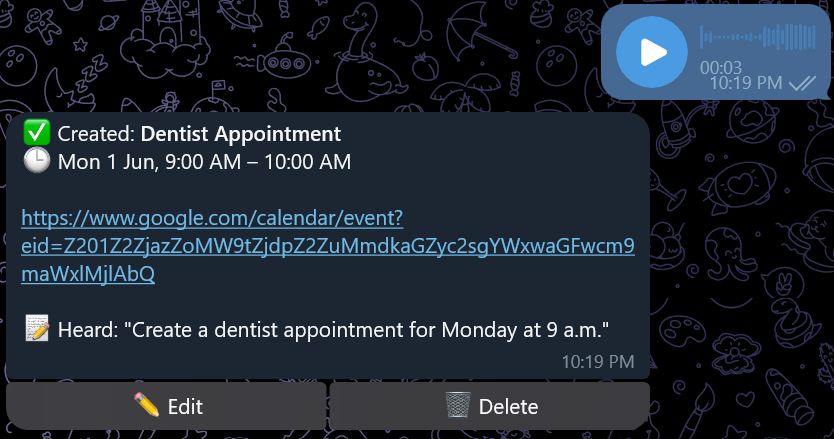
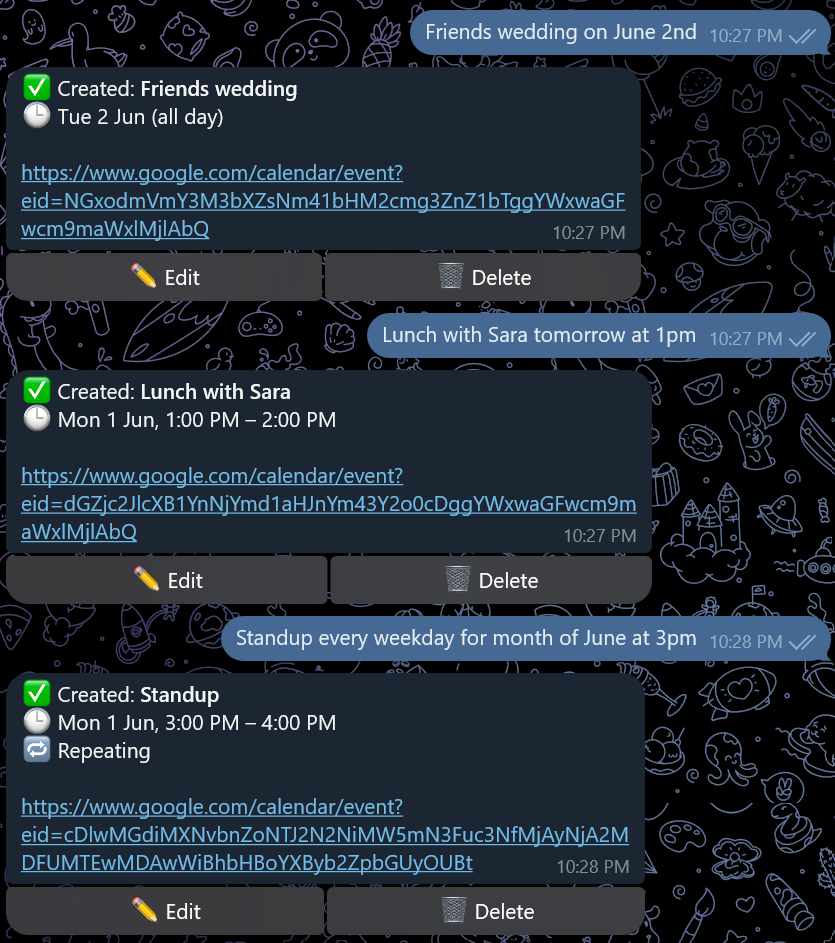
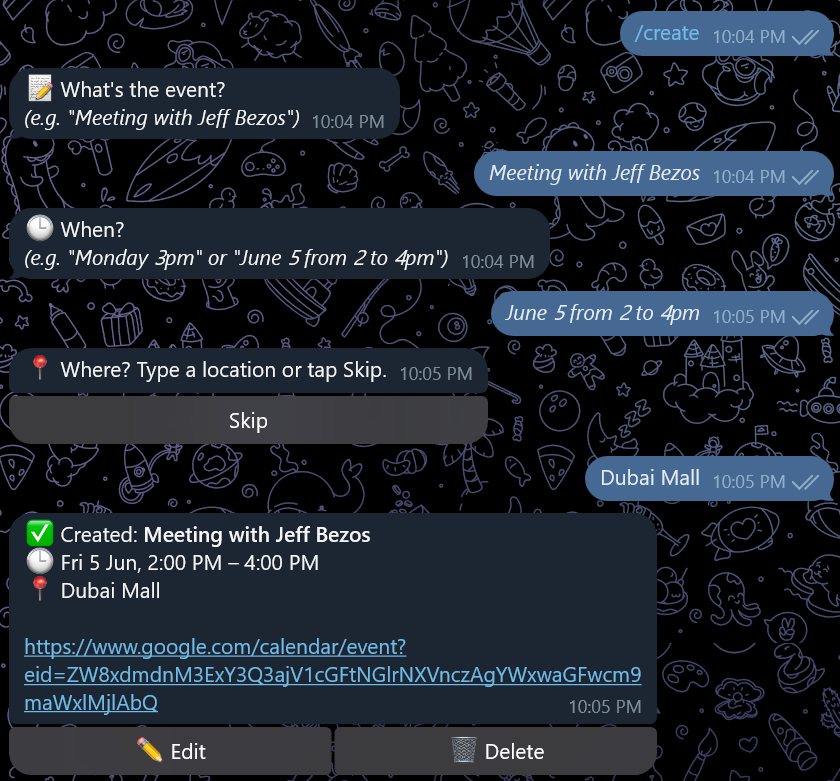
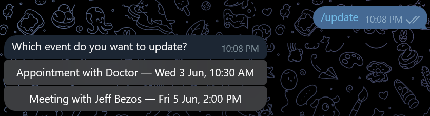
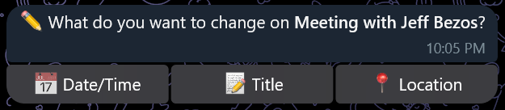
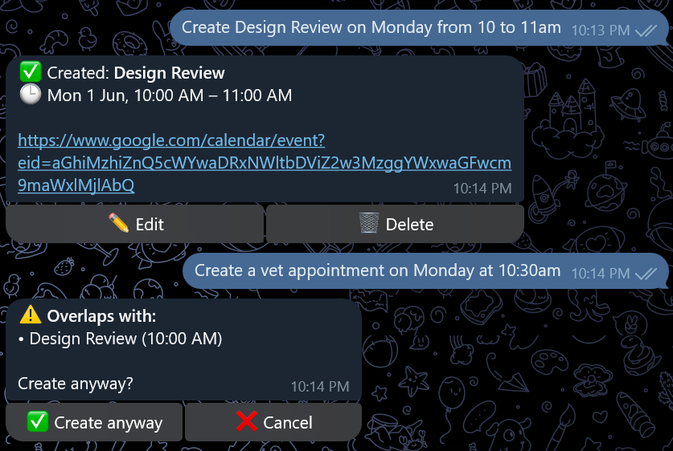
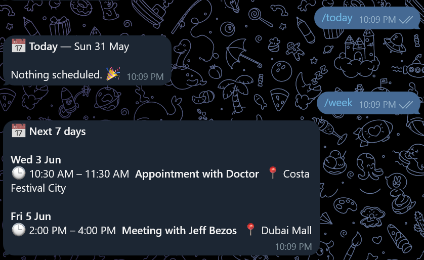
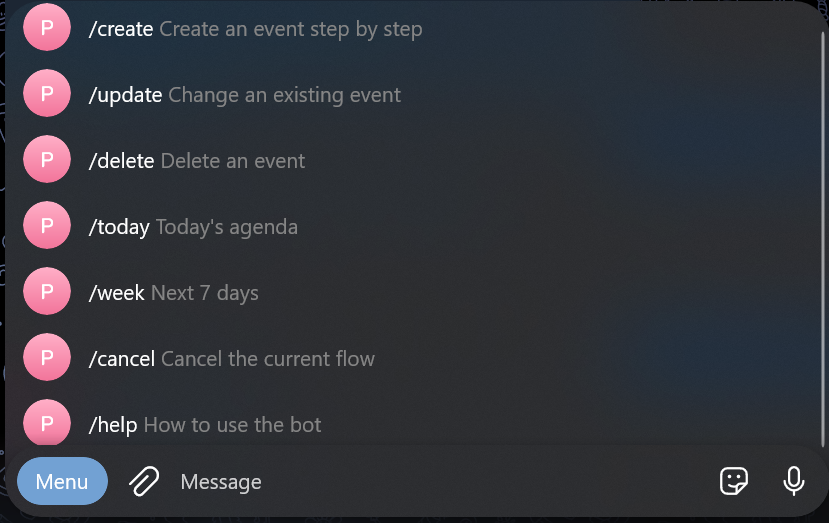
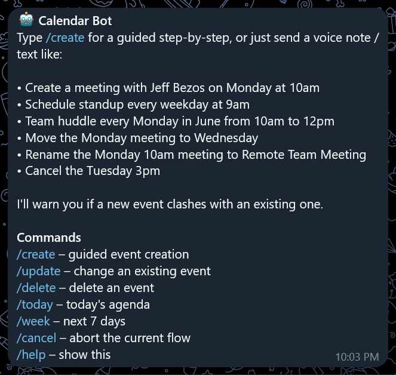

# 🗓️ Telegram Google Calendar Bot

A self-hosted Telegram bot that turns a **voice note or text message** into a Google Calendar event — and lets you update, reschedule, and delete events the same way. Say *"Meeting with the design team on Monday at 10am at Dubai Mall"* and it lands on your calendar, parsed and confirmed.

Built in plain PHP (no framework), it uses OpenAI Whisper for transcription and GPT‑4o‑mini for natural‑language understanding, talking to the Google Calendar API.

> **Single‑user by design.** The bot only responds to one Telegram account (yours). It is not a multi‑tenant SaaS.

---

## 📸 Screenshots

| Voice → event | Text command | Guided `/create` |
|:---:|:---:|:---:|
|  |  |  |

| Guided `/update` | Quick edit | Conflict warning |
|:---:|:---:|:---:|
|  |  |  |

| `/week` agenda | Command menu | `/start` |
|:---:|:---:|:---:|
|  |  |  |

---

## ✨ Features

- **Voice or text** — send a voice note or just type; both run the same pipeline.
- **Create / update / delete** events entirely in natural language.
- **Smart event matching** — refers to events by day/time ("the Monday 3pm meeting"), not exact titles. It reads your real calendar and picks the right event.
- **Guided flows with buttons** — `/create`, `/update`, `/delete` walk you through with inline‑keyboard buttons; messages edit in place, so no button clutter.
- **Recurring events** — "every weekday at 9am", "every Monday in June from 10am to 12pm".
- **Conflict detection** — warns you (and lets you create anyway) when a new event overlaps an existing one.
- **All-day events** — a date with no time ("Friends wedding on June 2") creates an all-day entry.
- **Verb-free creation** — "Dentist Thursday 9am" works; you don't have to say "create".
- **Agendas** — `/today` and `/week` summaries.
- **Quick actions** — every created event comes with ✏️ Edit / 🗑 Delete buttons.
- **Duplicate‑safe** — acknowledges Telegram instantly so retries can't double‑book.
- **Secrets stay out of the web root** — credentials, tokens, audio, and state live in a non‑public directory.

---

## 🧠 How it works

```
Telegram (voice/text)
        │
        ▼
telegram_webhook.php ──► acknowledge 200 immediately (no duplicate retries)
        │
        ├─ voice? ─► download .ogg ─► Whisper transcription ─► delete file
        │
        ▼
  GPT‑4o‑mini  ──►  structured JSON  { intent, date, time, recurrence, target_event_id, ... }
        │              (sees your upcoming events, matches by day/time)
        ▼
 Google Calendar API  ──►  create / update / delete
        │
        ▼
   Reply in Telegram (with quick‑action buttons)
```

- **Transcription:** OpenAI `gpt-4o-mini-transcribe` (Whisper).
- **Understanding:** OpenAI `gpt-4o-mini` with JSON mode — resolves relative dates ("Monday", "next week"), AM/PM, "from X to Y", and recurrence rules.
- **Calendar:** Google Calendar API via the official PHP client.

---

## 🧰 Tech stack

| Layer            | Tech                                            |
|------------------|-------------------------------------------------|
| Language         | PHP 8.x                                          |
| Transcription    | OpenAI Whisper (`gpt-4o-mini-transcribe`)        |
| NLU              | OpenAI `gpt-4o-mini` (JSON mode)                 |
| Calendar         | Google Calendar API (`google/apiclient`)         |
| Messaging        | Telegram Bot API (webhook)                       |
| State storage    | Flat JSON files (no database)                    |
| Hosting          | Any HTTPS PHP host (Apache/Nginx + PHP‑FPM)      |

---

## 📁 Project structure

```
calendar-bot/                     # web-accessible app directory
├── telegram_webhook.php          # Telegram webhook entry point + flow logic
├── telegram.php                  # Telegram API helpers (send, edit, download)
├── openai.php                    # Whisper transcription + GPT parsing
├── google_calendar.php           # Calendar create/read/update/delete + conflicts
├── google_oauth.php              # One-time Google authorization
├── config.example.php            # Config template — copy to config.php
├── config.php                    # YOUR SECRETS  (git-ignored, never commit)
├── credentials.example.json      # Google OAuth client template
├── composer.json
├── LICENSE
└── vendor/                       # git-ignored

/var/www/secrets/calendar-bot/    # OUTSIDE the web root — not URL-reachable
├── credentials.json              # Google OAuth client (the real one)
├── token.json                    # Google access/refresh token (auto-generated)
├── audio/                        # temp voice files (auto-deleted)
└── state/                        # per-conversation flow state (auto-expires)
```

---

## 📋 Getting your credentials

You need four things before you install. Gather them first, then run [Setup](#-setup).

### 1. Telegram bot token

1. Open [@BotFather](https://t.me/BotFather) in Telegram and send `/newbot`.
2. Give it a display name, then a username that ends in `bot` (e.g. `my_calendar_bot`).
3. BotFather replies with a token like `123456789:ABCdef...`. That's your **`TELEGRAM_BOT_TOKEN`**.

### 2. Your Telegram chat ID

The bot only answers you, so it needs your numeric ID.

1. Send any message (e.g. "hi") to the bot you just created.
2. Run this, substituting your token:
   ```bash
   curl "https://api.telegram.org/bot<TELEGRAM_BOT_TOKEN>/getUpdates"
   ```
3. In the JSON response, find `message.chat.id`. That number is your **`OWNER_CHAT_ID`**.

> ⚠️ Do this **before** setting the webhook — `getUpdates` and an active webhook are mutually exclusive.

### 3. OpenAI API key

1. Go to [platform.openai.com](https://platform.openai.com/api-keys) → **API keys** → **Create new secret key**.
2. Copy it immediately (it's shown only once). That's your **`OPENAI_API_KEY`**.
3. Add billing credit under **Settings → Billing**. Usage is tiny — a fraction of a cent per command.

### 4. Google `credentials.json` (and `token.json`)

`credentials.json` identifies *your app* to Google. `token.json` is *your personal* access/refresh token and is generated automatically the first time you authorize (Setup step 5) — you never create it by hand.

1. Open the [Google Cloud Console](https://console.cloud.google.com/) and create or select a project.
2. **APIs & Services → Library** → search **Google Calendar API** → **Enable**.
3. **APIs & Services → OAuth consent screen** → choose **External** → fill in the required app name / support email → **Save**. Under **Test users**, **add your own Google account** (see gotcha below).
4. **APIs & Services → Credentials → Create credentials → OAuth client ID** → application type **Web application**.
5. Under **Authorized redirect URIs**, add your redirect URL **exactly** as it will appear in `config.php`'s `GOOGLE_REDIRECT_URI` (e.g. `https://yourdomain.com/path/to/google_oauth.php`).
6. **Download JSON**, rename it to **`credentials.json`**, and place it in your secrets directory (created in Setup step 2). Use [`credentials.example.json`](credentials.example.json) as a reference for its shape.

**Google gotchas (these cause most "it won't connect" issues):**

- The consent screen stays in **Testing** mode unless you publish it, and a Testing app **only allows accounts listed as Test users** — if you skip step 3's test-user, authorization fails with `access_denied`.
- The redirect URI must match `GOOGLE_REDIRECT_URI` **character for character** — scheme (`https`), domain, path, and trailing slash all count.
- Your domain needs **valid HTTPS** — required for both the Google redirect and the Telegram webhook.

---

## 🚀 Setup

### Prerequisites

- A server with **PHP 8.x**, the **cURL extension**, and **HTTPS** (Telegram webhooks require a valid TLS certificate).
- **Composer**.
- The four credentials from [Getting your credentials](#-getting-your-credentials) above.

### 1. Clone & install

```bash
git clone https://github.com/<you>/<repo>.git calendar-bot
cd calendar-bot
composer require google/apiclient:^2.0
```

### 2. Create the secrets directory (outside the web root)

```bash
sudo mkdir -p /var/www/secrets/calendar-bot/audio /var/www/secrets/calendar-bot/state
sudo chown -R www-data:www-data /var/www/secrets/calendar-bot
sudo chmod -R 700 /var/www/secrets/calendar-bot
```

> Adjust the path so it is **beside or above** your document root, never inside it.

### 3. Add your Google client & config

```bash
# place the credentials.json you downloaded into the secrets dir:
sudo mv /path/to/downloaded/credentials.json /var/www/secrets/calendar-bot/credentials.json
sudo chown www-data:www-data /var/www/secrets/calendar-bot/credentials.json
sudo chmod 600 /var/www/secrets/calendar-bot/credentials.json

# create your config from the template:
cp config.example.php config.php
```

### 4. Configure

Edit `config.php` and fill in your values (see [Configuration](#-configuration)).

### 5. Authorize Google (one time)

Open `https://yourdomain.com/path/to/google_oauth.php` in a browser and grant access. A `token.json` is written into the secrets directory automatically.

### 6. Register the Telegram webhook

```bash
curl "https://api.telegram.org/bot<TELEGRAM_BOT_TOKEN>/setWebhook?url=https://yourdomain.com/path/to/telegram_webhook.php"
```

### 7. Register the command menu (optional but nice)

```bash
curl -s "https://api.telegram.org/bot<TELEGRAM_BOT_TOKEN>/setMyCommands" \
  -H "Content-Type: application/json" \
  -d '{"commands":[
        {"command":"create","description":"Create an event step by step"},
        {"command":"update","description":"Change an existing event"},
        {"command":"delete","description":"Delete an event"},
        {"command":"today","description":"Today’s agenda"},
        {"command":"week","description":"Next 7 days"},
        {"command":"cancel","description":"Cancel the current flow"},
        {"command":"help","description":"How to use the bot"}
      ]}'
```

Send `/help` to your bot — you're live.

---

## ⚙️ Configuration

`config.example.php`:

```php
<?php
// Telegram
define('TELEGRAM_BOT_TOKEN', 'YOUR_BOT_TOKEN');
define('OWNER_CHAT_ID', 0);                 // your numeric Telegram chat ID

// OpenAI
define('OPENAI_API_KEY', 'YOUR_OPENAI_KEY');

// Google
define('GOOGLE_REDIRECT_URI', 'https://yourdomain.com/path/to/google_oauth.php');
define('GOOGLE_CALENDAR_ID', 'primary');    // or a specific calendar address

// Secrets + temp storage — OUTSIDE the web root
define('SECRETS_DIR', '/var/www/secrets/calendar-bot');
define('AUDIO_DIR',   SECRETS_DIR . '/audio');
define('DEBUG_LOG',   false);               // true to log raw updates while developing

define('GOOGLE_CREDENTIALS_FILE', SECRETS_DIR . '/credentials.json');
define('GOOGLE_TOKEN_FILE',       SECRETS_DIR . '/token.json');
```

| Constant | Description |
|---|---|
| `TELEGRAM_BOT_TOKEN` | Bot token from BotFather. |
| `OWNER_CHAT_ID` | Only this Telegram user may use the bot. |
| `OPENAI_API_KEY` | OpenAI key for transcription + parsing. |
| `GOOGLE_REDIRECT_URI` | Must exactly match the URI registered in Google Cloud. |
| `GOOGLE_CALENDAR_ID` | `primary` or a calendar's address. |
| `SECRETS_DIR` | Non‑public directory for credentials/token/audio/state. |
| `DEBUG_LOG` | When `true`, writes the raw Telegram update to `SECRETS_DIR/last_update.json`. |

The bot assumes the **Asia/Dubai** timezone; change the `'Asia/Dubai'` references in `google_calendar.php`, `openai.php`, and `telegram_webhook.php` if you're elsewhere.

---

## 💬 Usage

Send a **voice note** or **text**, or use a guided command.

**Natural language (one‑shot):**

```
Create a meeting with the design team on Monday at 10am at Dubai Mall
Schedule standup every weekday at 9am
Team sync every Monday in June from 10am to 12pm
Move the Monday meeting to Wednesday
Reschedule Tuesday's 3pm to 5pm
Rename the Monday 10am meeting to Design Review
Cancel the Tuesday 3pm
Friends wedding on June 2
Dentist Thursday at 9am
```

**Guided commands:**

| Command | What it does |
|---|---|
| `/create` | Step‑by‑step: What → When → Where → Confirm |
| `/update` | Pick an event → choose a field → type the new value |
| `/delete` | Pick an event → confirm |
| `/today` | Today's agenda |
| `/week` | Next 7 days |
| `/cancel` | Abort the current guided flow |
| `/help` | Show usage |

**Phrasing tips:** always anchor to a **day**; add a **time** if two events share a day; `"from X to Y"` sets start and end; bare "3 o'clock" is read as 3 PM. A **date with no time** becomes an **all-day event**.

---

## 🔒 Security

This bot handles OAuth tokens and API keys. Treat them like passwords.

- **Never commit `config.php`, `credentials.json`, or `token.json`.** They are git‑ignored (see below). If you ever pushed real keys, **rotate them immediately** (OpenAI key, Telegram token, Google client secret).
- **Secrets live outside the web root** so they can't be downloaded over HTTP. Verify: `curl -I https://yourdomain.com/path/to/credentials.json` should return `404`.
- **Single‑user lock** — every request is checked against `OWNER_CHAT_ID`.
- **HTTPS only** — required by Telegram, and protects message content in transit.
- **Optional hardening:** set a Telegram webhook `secret_token` and verify the `X-Telegram-Bot-Api-Secret-Token` header in `telegram_webhook.php` to reject forged requests.

`.gitignore`:

```gitignore
config.php
credentials.json
token.json
*.log
last_update.json
/vendor/
```

---

## ⚠️ Limitations

- Single Google calendar, single user.
- Conflict detection checks only the **first occurrence** of a recurring event and ignores all‑day events.
- No native date picker — Telegram bots don't have one; date/time is typed or spoken (which is faster anyway).
- Processing is synchronous; the instant‑`200` acknowledgement requires **PHP‑FPM** (`fastcgi_finish_request`). Under mod_php it still works but waits for the API calls.
- Transcription and parsing use paid OpenAI APIs (cost is a fraction of a cent per command).

---

## 🗺️ Roadmap

- [ ] Mirror events to **Microsoft Outlook** (Microsoft Graph).
- [ ] **Reminders** / a daily morning‑agenda push (cron).
- [ ] **Attendee invites** via a name→email lookup.
- [ ] Multiple/selectable calendars.
- [ ] Full recurring‑series conflict checking.

---

## 🤝 Contributing

Issues and pull requests are welcome. This started as a personal tool, so expect rough edges.

---

## 📄 License

Released under the [MIT License](LICENSE).

---

## 📌 Disclaimer

Not affiliated with Telegram, Google, or OpenAI. You are responsible for your own API usage and costs, and for keeping your credentials secure.